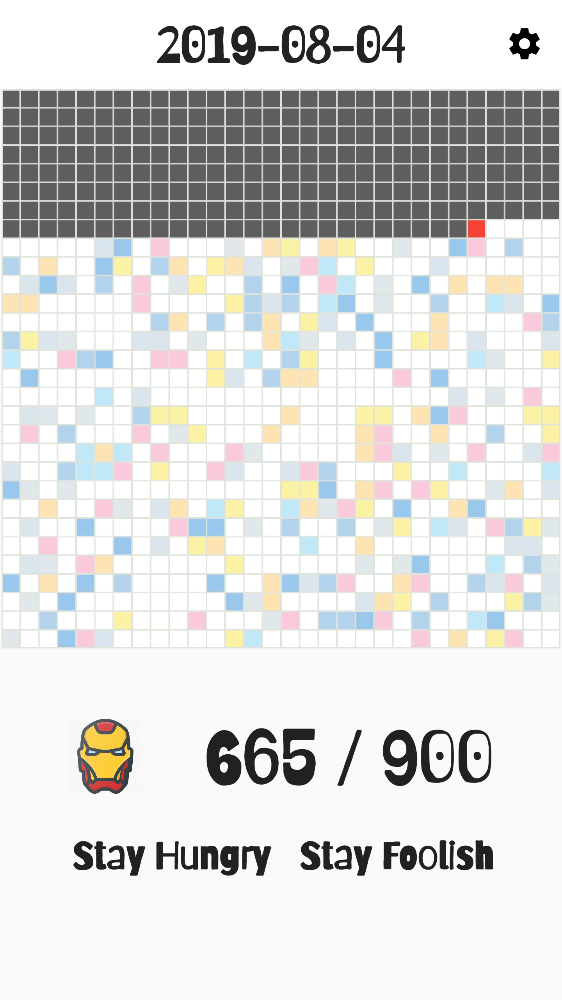
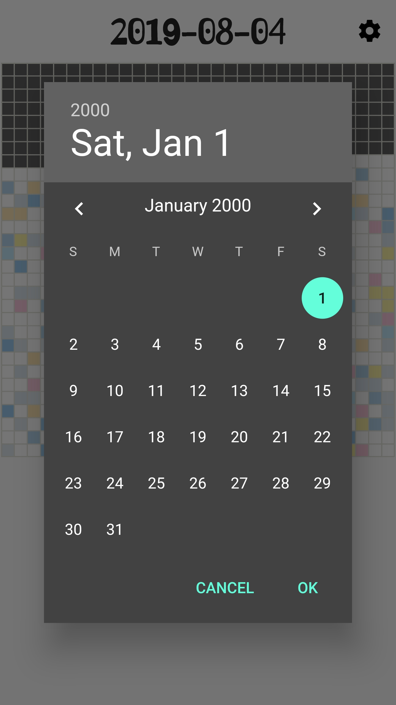

# 生命倒计时(LifeCountdown)

截止 `2018.5` 中国人均寿命已经达到 `76` 左右, 但估计中国程序员 `996.ICU`, 应该会稍微短一点, 方便计算就折合成 `75` 年. `75` * `12` 刚好是 `30` * `30` = `900` 个月, 这一生就只有 `900` 个月, 想起乔布斯那句话:

> Your time is limited, so don't waste it living someone else's life. Don't be trapped by dogma - which is living with the results of other people's thinking. Don't let the noise of others' opinions drown out your own inner voice. And most important, have the courage to follow your heart and intuition.

拿 `Flutter` 写了个计算生命还剩下多久的 `Demo`:




## 使用

* 下载源码

``` bash
git clone https://github.com/zhouzaihang/life_countdown.git
```

* 删除 `build`, `ios`, `android`, `test` 文件

* 使用 `Flutter` 初始化项目

``` bash
flutter init
```

For help getting started with Flutter, view [online documentation](https://flutter.dev/docs), which offers tutorials, samples, guidance on mobile development, and a full API reference.
